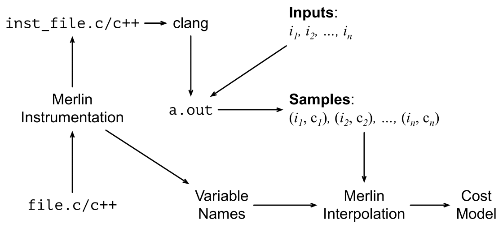

# Merlin 

<p align="center">
  </br>
</p>

## Introduction
Merlin is a tool that tries to infer the computational cost of C/C++ programs using polynomial interpolation. Merlin consists of two parts: a
`clang` plugin that adds instrumentation to programs by inserting counters, and a polynomial interpolator that uses the information generated by instrumentation to find a curve relating program inputs with computational cost. The figure below gives an overview of how Merlin works. For more details, check out our [paper](https://homepages.dcc.ufmg.br/~fernando/publications/papers/Merlin.pdf).
<p align="center">
  </br>
</p>

### Instrumentation
Merlin's instrumentation was implemented as a `clang` plugin that inserts counters inside loops bodies to count the number of iterations required by a program. The resulting program after instrumentation generate output in `stdout` that is used by Merlin's interpolator to find a curve that describes the computational cost of that program.

### Interpolation
Merlin, when dealing with programs influenced by a single input variable, uses [Newton's Divided Differences](https://en.wikipedia.org/wiki/Newton_polynomial) method for interpolating data points to find polynomials that fit the given data exactly. However, when dealing with programs costs that are influenced by multiple variables, Merlin uses the [least squares method](https://en.wikipedia.org/wiki/Linear_least_squares) to find good approximations for the function costs of the programs.

## Building 
To compile the instrumentation, access the script `merlin/instrumentation/scripts/setup.sh` and set the variable `LLVM_BUILD_DIR` to the directory where LLVM is built on your computer. Then, in the `merlin/instrumentation` directory, execute the script by running `scripts/setup.sh` to create your own build. After that, access the directory `merlin/interpolation` and run `make` to compile the interpolator code.

### Dependencies
These are the most important dependencies for building and running Merlin:

| Dependency | Version   | Installation Link                            |
|------------|-----------|----------------------------------------------|
| LLVM       | >= 14.0.0 | [llvm.org](https://llvm.org/docs/CMake.html) |
| CMake      | >= 3.20   | [cmake.org](https://cmake.org/install/)      |

Building LLVM on your computer may be troublesome. To make things easier, we have made a Docker image with all Merlin's dependencies that is available [here](./docker/).

## Running
To run the instrumentation,  access the script `merlin/instrumentation/scripts/run.sh` and set the variable `LLVM_BUILD_DIR` to the directory where LLVM is built on your computer. Then, in the `merlin/instrumentation` directory, execute the script by running `scripts/run.sh input_file output_file_name target_function`, where `input_file` is the directory for the file you want to instrument, `output_file_name` is just the name for the output file, and `target_function` is the name of the function to add the counters. After running the instrumentation, the instrumented program will be available in the `output` folder. 

### Step By Step 
Consider the following Bubble Sort algorithm implementation:
```c++
void swap(int* a, int* b) {
  int temp = *a;
  *a = *b;
  *b = temp;
}

void bubble_sort(int n, int *arr) {
  int i = 0;
  while (i < n) {
    int j = i + 1;
    while (j < n) {
      if (arr[j] < arr[i])
        swap(&arr[i], &arr[j]);
      j++;
    }
    i++;
  }
}
```

After instrumenting this code by using `scripts/run.sh BubbleSort.c BubbleSort.c bubble_sort`, the following instrumented code is generated:
``` c++
void swap(int *a, int *b) {
  int temp = *a;
  *a = *b;
  *b = temp;
}

void bubble_sort(int n, int *arr) {
  unsigned counterbubble_sort0 = 0;
  unsigned counterbubble_sort1 = 0;

  int tempn = n;

  int i = 0;
  while (i < n) {
    counterbubble_sort0++;
    int j = i + 1;
    while (j < n) {
      counterbubble_sort1++;
      if (arr[j] < arr[i]) { 
        swap(&arr[i], &arr[j]);
      }
      j++;
    }
    i++;
  }

  printf("2\n");                                    // Number of Counters
  printf("at line 9 :");                            // Program Point of the first counter
  printf(" n\n");                                   // Input variable that controls the counter
  printf("at line 11 :");                           // Program Point of the second counter
  printf(" n\n");                                   // Input variable that controls the counter
  printf("%d %d\n", tempn, counterbubble_sort0);    // First Counter result
  printf("%d %d\n", tempn, counterbubble_sort1);    // Second Counter result
}
```

Having instrumented the code, our subsequent task involves compiling the program and executing it using a range of input entries. This is essential for generating the necessary sample data, which will be used for conducting the interpolation. Specifically, the code was executed for the following input values:

``` c++
int main() {
  int v1[5] = {1, 2, 3, 4, 5};
  int v2[3] = {1, 2, 3};
  int v3[7] = {1, 2, 3, 4, 5, 6, 7};
  int v4[10] = {1, 2, 3, 4, 5, 6, 7, 8, 9, 10};

  bubble_sort(5, v1);
  bubble_sort(3, v2);
  bubble_sort(7, v3);
  bubble_sort(10, v4);
  return 0;
}
```

By running the program with these specific inputs, we obtained the following results:
```
2
at line 9 : n
at line 11 : n
5 5
5 10
2
at line 9 : n
at line 11 : n
3 3
3 3
2
at line 9 : n
at line 11 : n
7 7
7 21
2
at line 9 : n
at line 11 : n
10 10
10 45
```
In order to perform the interpolation on this data, it is essential to eliminate any repetitions in both the counter numbers and the program point indications. Additionally, you should include the number of points being used after the number of counters. In this case, we are utilizing four points for the interpolation.
```
2
4 --> Number of Points
at line 9 : n
at line 11 : n
5 5
5 10
3 3
3 3
7 7
7 21
10 10
10 45
```

You can generate the interpolations using the compiled interpolator by running the command, in the `interpolation` directory, `bin/interpolator < input/bubbleSortData.txt`. When this command is executed, it produces the following result:
```
at line 9 : n
x: n
F(x) = x

at line 11 : n
x: n
F(x) = 0.5*x*(x - 1)
```

This output indicates the following:
```
at line 9 : n           --> Program Point analysed 
x: n                    --> Variable represented by x
F(x) = x                --> Interpolated function for the Program Point

at line 11 : n          --> Program Point analysed 
x: n                    --> Variable represented by x
F(x) = 0.5*x*(x - 1)    --> Interpolated function for the Program Point
```
In this case, the first program point is the outer while statement, which is influenced by the variable `n` and has the cost function `F(n) = n`. For the second program point, representing the inner while statement, which is solely influenced by the variable `n`, the cost function is `F(n) = 0.5 * n * (n - 1)`.

## Cite this Work

The ideas in this work are described in more details in [this paper](https://homepages.dcc.ufmg.br/~fernando/publications/papers/Merlin.pdf), which was published in the Brazilian Symposium on Programming Languages (SBLP 2023).
You can cite it as follows:

```
@inproceedings{SumitaniSBLP23,
    author = {Rafael Fontes Sumitani and Lucas Victor da Silva Costa and Frederico F. Campos and Fernando Magno Quintao Pereira},
    title = {A Class of Programs that Admit Exact Complexity Analysis via Newton’s Polynomial Interpolation},
    year = {2023},
    publisher = {Association for Computing Machinery},
    booktitle = {Proceedings of the 2023 Brazilian Symposium on Programming Languages},
    location = {Campo Grande, Brazil},
    series = {SBLP'23},
    doi={10.1145/3624309.3624311},
}
```
